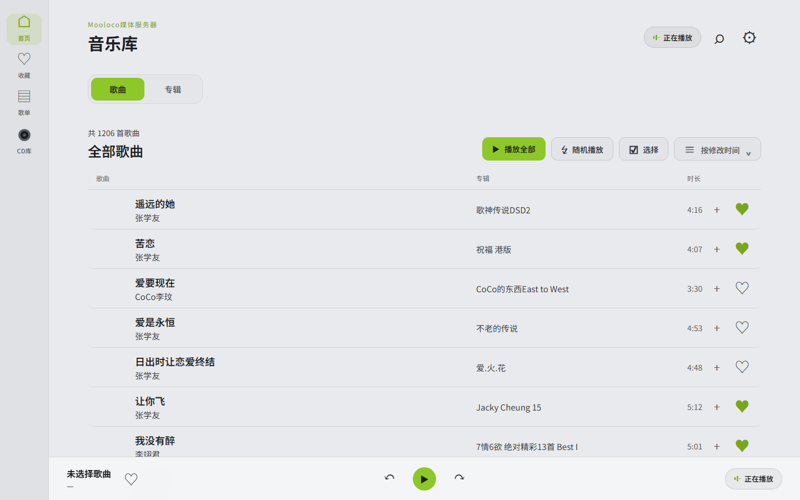
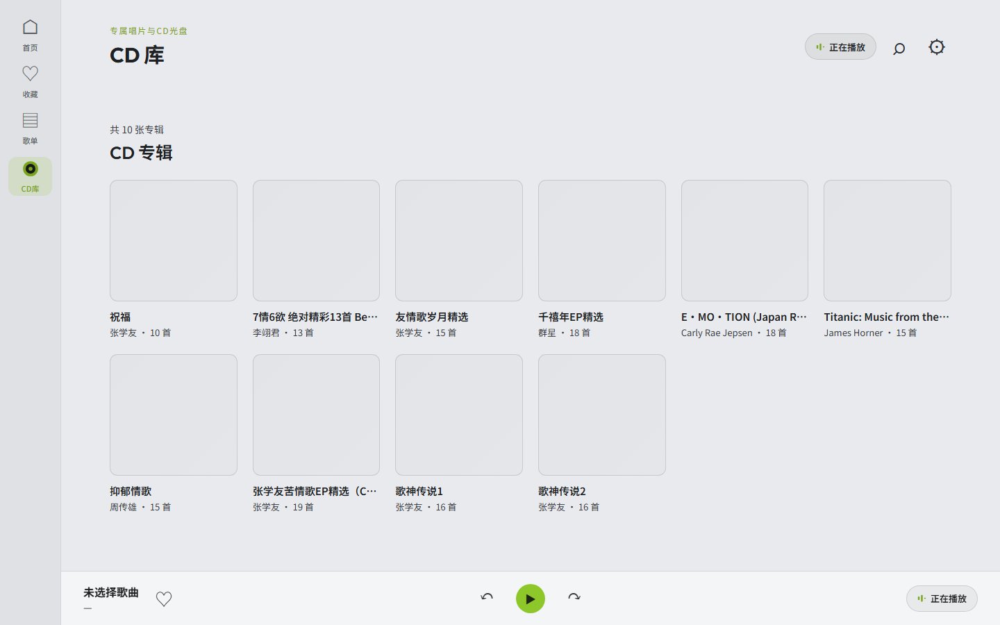

# 音律 · Mooloco Music

一个运行在局域网内的 Web 音乐播放器：**Python 标准库后端 + 原生 JavaScript 前端**，无任何前端框架与构建步骤。后端负责媒体库扫描与音频流式传输，前端负责播放、歌词、歌单等交互，音频由浏览器原生解码（解码质量取决于客户端设备）。

- 支持 **flac / mp3 / m4a / ogg / wav** 等主流音频格式（依赖浏览器解码能力）
- 同一局域网内任何设备（电脑 / 手机 / 平板 / 车机浏览器）访问一个网址即可播放
- 内置**按需转码**：高码率音源（如 flac）播放时可选转成 AAC/MP3，节省带宽
- 内置**CD 库**：第一层文件夹即专辑，配合 `info.jsonc` 呈现完整专辑信息
- 提供 **Docker 镜像（amd64 / arm64）**，一键部署；主题默认亮色，可切换暗色

<p align="center">
  
  
</p>

---

## 目录

1. [运行环境与快速开始](#运行环境与快速开始)
2. [界面总览](#界面总览)
3. [功能详细用法](#功能详细用法)
4. [数据文件](#数据文件)
5. [环境变量](#环境变量)
6. [技术架构](#技术架构)
7. [部署到服务器](#部署到服务器)
8. [常见问题](#常见问题)

---

## 运行环境与快速开始

### 环境要求

| 依赖 | 必需 | 说明 |
|---|---|---|
| Python 3.10+ | ✅ | 后端运行环境 |
| [mutagen](https://pypi.org/project/mutagen/) | ✅ | 读取音频元数据（时长 / 标签 / 内嵌封面 / 内嵌歌词） |
| ffmpeg | ⭕ 转码功能需要 | 仅开启「转码播放」时需要；不开启则完全不需要 |

### 安装与启动

```bash
# 1. 安装 Python 依赖
pip install mutagen

# 2. （可选）安装 ffmpeg，用于转码播放
#    Debian/Ubuntu:  sudo apt install ffmpeg
#    macOS:          brew install ffmpeg
#    Windows:        从 ffmpeg.org 下载并加入 PATH

# 3. 启动
python server.py        # 或 python3 server.py
```

启动后访问 **http://\<本机IP\>:8090**（默认监听 0.0.0.0:8090，局域网内所有设备可访问）。

> 未设置任何环境变量时行为与上文一致；路径/端口/缓存等可用环境变量定制，见[环境变量](#环境变量)。

### Docker 运行（推荐，amd64 / arm64）

镜像内置 Python + mutagen + ffmpeg（转码开箱即用，AAC/MP3 编码均已验证），数据与音乐库通过卷挂载：

```bash
# 构建双架构镜像(镜像发布到 Docker Hub 后可直接 docker pull mooloco/music-player:1.1)
# docker buildx build --platform linux/amd64,linux/arm64 -t mooloco/music-player:1.1 .

docker run -d --name music-player --restart unless-stopped -p 8090:8090 \
  -e MUSIC_LIBRARY_PATH=/music -e MUSIC_CDLIB_PATH=/tracker \
  -v music_data:/data \
  -v /path/to/music:/music:ro \
  -v /path/to/tracker:/tracker:ro \
  mooloco/music-player:1.1
```

- 首次启动若设置了 `MUSIC_LIBRARY_PATH` / `MUSIC_CDLIB_PATH` 且 `/data` 卷中无库文件，将**后台自动扫描**；此后重启不会重扫（索引已持久化在卷里）
- 不设自动扫描变量也可以：打开网页 → ⚙ 设置 → 媒体库路径填容器内挂载点（如 `/music`）→ 开始扫描
- 转码缓存默认在容器 `/tmp/transcode`（可丢弃，自动重建）；封面内存缓存上限默认 128MB（`MUSIC_COVER_MEM_MB`）
- 等价 compose 配置见仓库内 [docker-compose.yml](docker-compose.yml)

### 首次使用三步

1. 点击右上角 **⚙ 设置** → 填写**媒体库路径**（音乐文件所在目录，如 `/home/music`）→ 点 **「开始扫描」**
2. 等待扫描完成（状态行会显示「扫描完成：发现 N 首歌曲」）
3. 回到首页即可看到歌曲列表，点击任意歌曲开始播放

> 媒体库按目录**递归**扫描；CD 库只扫描第一层子文件夹（见 [CD 库](#5-cd-库)）。

---

## 界面总览

```
┌─────────┬──────────────────────────────────────┐
│ 侧边栏   │  顶栏：页面标题         ⌁  ⌕  ⚙      │
│ 首页     │                                      │
│ 收藏     │  内容区（歌曲 / 专辑 / 歌单 / CD库）  │
│ 歌单     │                                      │
│ CD库     │                                      │
├─────────┴──────────────────────────────────────┤
│ 底部播放栏：歌曲信息   ⏮ ▶ ⏭   ♬ ▤ ⌁           │
└─────────────────────────────────────────────────┘
```

- **侧边栏**（桌面端在左侧，移动端 ≤820px 变为页面顶部横排导航）：首页 / 收藏 / 歌单 / CD库
- **顶栏**：当前页面标题 + 搜索（⌕）+ 设置（⚙）
- **底部播放栏**：当前歌曲信息、播放控制、收藏按钮；点击播放栏可进入全屏歌词页

---

## 功能详细用法

### 1. 媒体库（首页）

**扫描音乐**：设置 → 填写「媒体库路径」→ 「开始扫描」。支持服务器本地目录，程序需有读取权限。

**歌曲 / 专辑视图**：顶部的「歌曲」「专辑」两个标签页切换。
- 歌曲视图：完整曲目列表（封面、歌名、歌手、专辑、时长、收藏/加入歌单按钮）
- 专辑视图：按专辑分组的封面网格，点击专辑进入该专辑的曲目过滤列表，点「← 返回全部」回到完整列表

**列表操作**：

| 操作 | 入口 | 说明 |
|---|---|---|
| 播放歌曲 | 点击歌曲行 | 以**当前列表**为队列开始循环播放 |
| 播放全部 | 「▶ 播放全部」 | 从列表第一首开始顺序播放 |
| 随机播放 | 「↯ 随机播放」 | 从列表随机一首开始（后续随机切换） |
| 收藏 | 行内 ♡ 按钮 | 红心收藏 / 取消 |
| 加入歌单 | 行内 ＋ 按钮 | 弹出歌单选择器，单曲快捷加入 |
| 批量选择 | 「☑ 选择」 | 进入选择模式，勾选多首 → 底部选择栏「加入歌单」/「取消」 |

### 2. 播放与播放队列

**核心机制：点击歌曲 = 把当前看到的列表快照为播放队列，循环播放。**

- 在歌曲列表、专辑详情、歌单详情、CD 专辑详情、搜索结果中点击任意一首，**当前视图的整个列表**就成为播放队列（如点击专辑内第 3 首，则从第 3 首起按该专辑顺序播放）
- **上一首 / 下一首始终在队列内工作**，切换视图（首页 → CD库 等）不会打断队列，也不会丢失上一首/下一首
- 播放栏操作：⏮ 上一首 / ▶ 播放暂停 / ⏭ 下一首
- 音频结束自动播放队列下一首，队列播完循环
- **进度条**：进入全屏歌词页后，顶部进度条支持点击/拖动跳转（转码播放开启时进度条失效，见文末「作者声明」）
- **媒体按键**：通过 MediaSession 支持耳机/车机的播放暂停、上一首/下一首、快进快退按键

### 3. 收藏

- 歌曲行内、CD 曲目行内、播放栏均有 ♡/♥ 按钮，点击即收藏/取消收藏
- 侧边栏「收藏」查看全部收藏（按收藏时间倒序）

### 4. 歌单

**新建歌单**：歌单页 → 「+ 新建歌单」→ 输入名称回车确认（或点「创建」），「取消」放弃。

**添加歌曲**，两种方式：
1. **单曲快捷加入**：任意歌曲行 / CD 曲目行的 **＋** 按钮 → 选择器中选择歌单（或输入新歌单名「创建并加入」），提示「已加入「歌单名」」
2. **批量加入**：「☑ 选择」勾选多首 → 底部选择栏「加入歌单」→ 选择目标歌单

**歌单详情**：点击歌单卡片进入，可：
- 「← 返回歌单」回到列表
- 「🗑 删除歌单」（删除后歌曲不受影响）
- 行内 **×** 从该歌单移除单曲
- 重复添加同一首到同一歌单会自动去重，并**将该曲目移到歌单最前**

### 5. CD 库

CD 库与媒体库**完全独立**，用于按"整张专辑"组织的高保真音源（如本地抓轨的 flac）。

**目录结构约定**：CD 库路径下的**第一层子文件夹 = 一张专辑**（不递归更深层），专辑文件夹内的音频文件直接作为曲目。

```
/mnt/cd/
├── 1993.张学友.祝福 港版/          ← 专辑 1
│   ├── (01) [張學友] 祝福.flac
│   ├── (02) [張學友] 回頭太難.flac
│   └── cover.jpg                   ← 专辑封面（可选）
└── 1998.李翊君.7情6欲 精选/       ← 专辑 2
    └── ...
```

**扫描**：设置 → 填写「CD库路径」→ 「开始扫描」。

**专辑网格**：侧边栏「CD库」→ 封面网格，点击专辑进入**专辑详情页**：
- 大封面 + 专辑信息（标题、歌手、标签、发行信息、简介）
- 「▶ 播放CD音轨」按钮：从第一首开始播放整张专辑
- 曲目列表：曲号、歌名、文件大小、时长，行内 ＋ 加入歌单 / ♡ 收藏

**文件名规范**：曲目号优先取**文件名前缀**（`01 x.flac` 中的 `01`），标签中的 tracknumber 仅作后备——抓轨/转换过的文件标签可能带错误曲号，用文件名前缀最可靠。

**info.jsonc（可选，专辑元数据）**：在专辑文件夹放一个 `info.jsonc`，可精细控制专辑的显示信息与封面（支持注释，见下方示例）：

```jsonc
{
  // 专辑信息：专辑名/歌手/风格/类型/简介/发行公司/发行日期/封面文件名
  "album": {
    "title": "祝福",                 // 专辑标题（缺省用文件夹名）
    "artist": "张学友",              // 歌手（缺省按全专辑曲目歌手频次统计）
    "albumArtist": "张学友",
    "style": "粤语流行 Cantopop",
    "genre": "流行 / 粤语",
    "description": "1993年发行的粤语专辑，收录……",
    "publisher": "宝丽金",
    "releaseDate": "1993-12-01",
    "cover": "cover.jpg"
  },
  // 可选：逐曲目信息覆盖（缺省读文件标签）
  "tracks": [
    { "number": 1, "title": "祝福", "artist": "张学友", "file": "(01) [張學友] 祝福.flac" }
  ]
}
```

**信息优先级**：
- 专辑标题：info.jsonc `title` → 文件夹名
- 歌手：info.jsonc `artist` → 全专辑曲目歌手频次统计（合唱标签自动拆分）→ 从文件夹名解析「歌手 - 专辑」→ 未知歌手
- 封面：info.jsonc `cover` → `cover.jpg` / `cover.png` 等常见文件名 → 第一首曲目的内嵌封面

### 6. 歌词

**歌词来源**（按优先级）：
1. 音频文件**内嵌歌词**（如 flac/ogg 的歌词标签）
2. 与音频文件**同目录同名**的 `.lrc` 文件（如 `祝福.flac` 旁放 `祝福.lrc`）

**全屏歌词页**：点击**底部播放栏**进入（桌面端点击播放栏任意区域；移动端点击左侧歌曲信息区）。页面包含：
- 封面大图 + 歌曲信息 + 可拖动进度条 + 播放控制
- 右侧滚动歌词，当前行高亮并自动滚动跟随
- **点击任意歌词行**跳转到对应时间播放
- 底部「随机播放」按钮：切换队列内随机/顺序切歌

### 7. 搜索

顶栏 **⌕** 打开搜索，输入歌名实时过滤，结果列表支持播放、收藏、加入歌单（与歌曲行操作一致）。按 **Esc** 或点击遮罩关闭。

### 8. 转码播放

**用途**：flac 等无损音源的码率通常 600–900kbps，在局域网或车机场景带宽占用大。开启转码后，服务端用 ffmpeg 将高码率音源实时转为低码率 AAC/MP3 再播放，显著节省带宽；转码结果自动缓存，后续播放秒开。

**入口**：设置 → **⚡ 转码设置**。

**设置项**：

| 设置项 | 选项 | 说明 |
|---|---|---|
| 转码播放开关 | 开 / 关 | 关 = 完全直连源文件播放（与无此功能时一致） |
| 目标格式 | AAC / MP3 | 转码输出格式 |
| 码率 | 64 / 96 / 128 / 192 / 256 / 320 k | 输出码率，越高音质越好、带宽越大 |
| 缓存位置 | 程序目录 `transcode` / `/tmp/transcode` | 转码缓存存放位置 |
| 缓存大小 | 512 MB / 1 / 2 / 4 / 8 GB | 缓存上限，超限自动删最旧文件 |
| 缓存占用 | 实时显示 + 「清空缓存」按钮 | 当前占用大小与文件数，可一键清空 |

**保存并应用（OpenWrt 风格）**：所有改动（包括开关）只先暂存在本地，点 **「保存并应用」** 才真正生效；关闭设置面板 = 放弃未保存的改动。切换设置内的标签页不会丢失暂存。

**播放行为**：
- 仅当**源文件码率 > 400kbps** 时才转码（flac 通常自动命中）；低码率音源直接原样播放
- **边转边播**：ffmpeg 实时转码边输出边播放，无需等待整曲转完
- **预转下一首**：播放当前曲目时后台预生成下一首开头 3 秒的缓冲，切歌几乎无延迟
- **seek**：缓存完整的曲目秒级精确跳转；未缓存的转码流从目标秒重新转码播放（约 1–2 秒缓冲）
- **缓存命中**：播放过的曲目再次播放直接读缓存文件，毫秒级开始

**缓存机制**：缓存文件名由 `曲目路径 + 格式 + 码率` 决定——修改格式或码率后旧缓存不匹配，会自动重新转码（旧缓存按大小上限滚动淘汰；也可「清空缓存」立即清理）。**关闭转码开关后播放完全不使用缓存，直接读源文件**，缓存文件不会被删除（除非清空或超限）。

### 9. 设置

| 设置项 | 说明 |
|---|---|
| 媒体库路径 + 开始扫描 | 媒体库扫描（递归） |
| CD库路径 + 开始扫描 | CD 库扫描（第一层文件夹 = 专辑） |
| ⚡ 转码设置 | 见上文第 8 节 |

> 移动端（≤820px）：设置页是一个独立的 hash 路由页面（`/#settings`），支持浏览器返回键退出；桌面端为弹出式面板。

### 10. 移动端适配与浏览器返回

- **≤820px**：侧边导航变为页面顶部横排导航条（首页/收藏/歌单/CD库）
- 全站响应式，专辑详情、设置页等均适配窄屏
- **浏览器返回键**：依次关闭歌词/搜索/设置等浮层 → 返回上一个视图 → 退出应用
- **刷新保持位置**：当前视图（含歌单详情、CD 专辑详情、设置页）编码在 URL hash 中，刷新后自动恢复

---

## 数据文件

运行目录下自动生成 `data/` 文件夹，所有数据为 JSON 明文，可直接查看/备份：

| 文件 | 内容 |
|---|---|
| `data/library.json` | 媒体库扫描结果（曲目、专辑） |
| `data/cdlibrary.json` | CD 库扫描结果 |
| `data/favorites.json` | 收藏列表 |
| `data/playlists.json` | 歌单 |
| `data/transcode.json` | 转码配置 |
| `data/covers/` | 封面磁盘缓存 |
| `transcode/` 或 `/tmp/transcode` | 转码音频缓存（按配置位置） |

> 目录位置可用环境变量整体迁移（如容器里数据落在 `/data` 卷），见下节。

---

## 环境变量

全部可选；**不设置时行为与默认值一致**（裸跑开箱即用）。主要用于 Docker 部署与定制化运行。

| 变量 | 默认 | 说明 |
|---|---|---|
| `MUSIC_DATA_DIR` | `<程序目录>/data` | 索引/收藏/播放列表/封面等数据文件目录（容器挂卷时设为 `/data`） |
| `MUSIC_CACHE_DIR` | `<程序目录>/transcode` | 转码缓存目录（`transcode.json` 中缓存位置为空时生效） |
| `MUSIC_PORT` | `8090` | 监听端口 |
| `MUSIC_COVER_MEM_MB` | `768` | 封面内存缓存上限（MB，LRU 淘汰；小内存设备建议调低，容器默认 128） |
| `MUSIC_LIBRARY_PATH` | 空 | 首次启动自动扫描的媒体库路径（库文件已存在则跳过） |
| `MUSIC_CDLIB_PATH` | 空 | 首次启动自动扫描的 CD 库路径（同上） |

示例（systemd 或 shell）：

```bash
MUSIC_DATA_DIR=/srv/music-player-data MUSIC_PORT=8090 python3 server.py
```

---

## 技术架构

- **后端**：Python 标准库 `http.server`（ThreadingHTTPServer，端口默认 8090）+ mutagen；无第三方 Web 框架
- **前端**：单文件原生 JS（`app.js`）+ HTML/CSS，无构建步骤、无框架；主题亮/暗可切，默认亮色（localStorage 记忆）
- **Docker**：`python:3.11-alpine` 基础镜像内置 ffmpeg + tzdata，amd64/arm64 双架构；数据卷 `/data`、音乐卷只读挂载
- **音频传输**：`/api/stream` 支持 HTTP Range（206），浏览器原生解码播放；转码走 ffmpeg stdout 管道边转边播
- **hash 路由**：`#library` / `#favorites` / `#playlists` / `#cdlib` / `#playlist=<id>` / `#cdalbum=<目录>` / `#settings`，支持前进后退与刷新恢复
- **播放队列与视图解耦**：点击歌曲快照当前列表为队列，视图切换不影响播放
- **安全**：所有受控接口（音频流、封面、收藏、歌单）校验曲目必须存在于已扫描索引中；前端输出统一转义防 XSS

主要 API：`GET /api/library`、`POST /api/library/scan`、`GET/POST /api/favorites`、`GET/POST /api/playlists(+/add/remove)`、`GET /api/cdlib`、`POST /api/cdlib/scan`、`GET /api/stream?id=<路径>`、`GET /api/cover?id=<路径>`、`GET/POST /api/transcode-config`、`GET /api/transcode-cache`、`POST /api/transcode-cache/clear`、`POST /api/transcode/preload`。

---

## 部署到服务器

### Docker Compose（推荐）

仓库内 [docker-compose.yml](docker-compose.yml) 已配好端口、卷与自动扫描变量：

```bash
docker compose up -d
```

### systemd 裸跑

以 Linux + systemd 为例：

```ini
# /etc/systemd/system/musicplayer.service
[Unit]
Description=Mooloco Music Player
After=network.target

[Service]
WorkingDirectory=/opt/music-player
ExecStart=/usr/bin/python3 server.py
Restart=always
User=root

[Install]
WantedBy=multi-user.target
```

```bash
systemctl daemon-reload
systemctl enable --now musicplayer.service
```

> 修改 `server.py` 后需 `systemctl restart musicplayer.service`；静态文件（HTML/CSS/JS）无需重启。

---

## 常见问题

**Q：转码开关打开后，为什么有些歌看起来没被转码？**
只有源文件码率 **>400kbps** 的曲目才会转码，低码率音源直接原样播放。

**Q：关掉转码后还会用缓存里的低码率版本吗？**
不会。关闭转码 = 完全直连源文件播放，缓存被完全绕过（缓存文件保留在磁盘，重开转码后若格式码率一致可命中）。

**Q：转码开启时进度条还能用吗？**
不能。转码播放开启时，进度条（点击/拖动跳转）会失效，暂未修复；关闭转码播放后进度条恢复正常。详见文末「作者声明」。

**Q：媒体库和 CD 库有什么区别？**
媒体库按目录递归扫描，适合按歌/按专辑松散整理；CD 库只扫第一层文件夹、每文件夹视为一张专辑，配合 `info.jsonc` 展示完整的专辑信息（封面/简介/发行信息），适合整张无损专辑收藏。

**Q：为什么同一首歌在不同设备上听感不同（如低音差异）？**
本播放器不做任何音频处理（无 EQ/增益/重采样），解码输出即源文件原声。听感差异来自客户端设备的解码器与音频输出链路（浏览器/车机 WebView 的音频策略、系统音效等），非本播放器所致。


---

## 作者声明

> **已知问题**：转码开启的情况下，进度条（点击/拖动跳转）会失效，暂未修复。如需正常使用进度条，请关闭转码播放。
